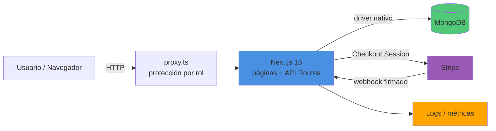

# 🛒 Ecommerce — Next.js + MongoDB + Stripe

Tienda online completa con catálogo, carrito persistente, pago real con Stripe
Checkout (confirmado por webhook) y panel de administración con roles.

> Especificación completa: [PROMPT.md](PROMPT.md) · Guía operativa: [AGENTS.md](AGENTS.md)
> · Arranque rápido: [QUICKSTART.md](QUICKSTART.md)

## Arquitectura



- **Rutas por rol** (route groups): `(public)` catálogo/login, `(customer)` carrito/pedidos,
  `(admin)/admin` panel de gestión.
- **Auth artesanal**: JWT (`jose`) en cookie `httpOnly` + `bcryptjs`; `proxy.ts`
  (ex-middleware de Next 16) redirige según el rol.
- **Pagos**: `POST /api/checkout` crea la sesión de Stripe → webhook `/api/stripe/webhook`
  verifica la firma y marca el pedido `paid` (con verificación de respaldo en la página de éxito).
- **Dinero en céntimos (enteros)** en toda la aplicación.

## Instalación y arranque

Ver [QUICKSTART.md](QUICKSTART.md) (camino mínimo) o [AGENTS.md](AGENTS.md) (detalle).

```bash
npm install
docker run -d --name ecommerce-mongo -p 27017:27017 mongo:7
cp .env.example .env.local   # rellenar claves de Stripe
npm run seed                 # productos de ejemplo + admin (admin@ecommerce.dev / admin123)
npm run dev
```

## Tests

```bash
npm test        # Vitest: unitarios (dinero, auth, validación) + integración MongoDB
```

Los tests de integración se saltan limpiamente si MongoDB no está disponible
(p. ej. en el runner de CI).

## Métricas

<!-- TODO: resultados de autocannon (p50/p95/p99) y explain() de MongoDB antes de la entrega — objetivos en PROMPT.md §5 -->

## CI / Deployment

Pipeline en `.gitlab-ci.yml` (templates de la academia; solo el job `build` — ver
[AGENTS.md](AGENTS.md) §CI). Imagen de producción: `Dockerfile` multi-stage standalone.
